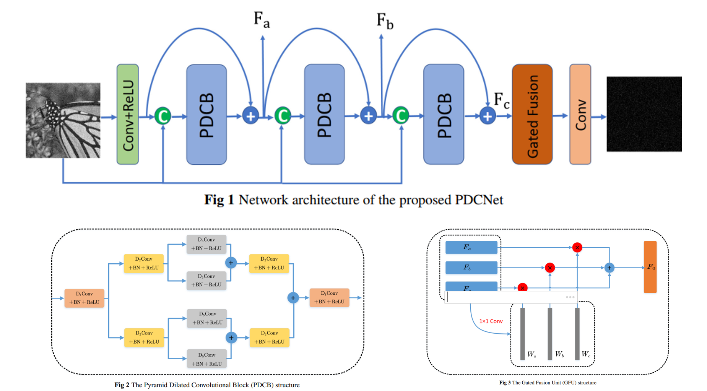
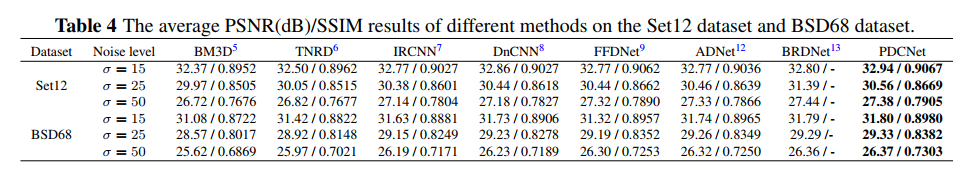
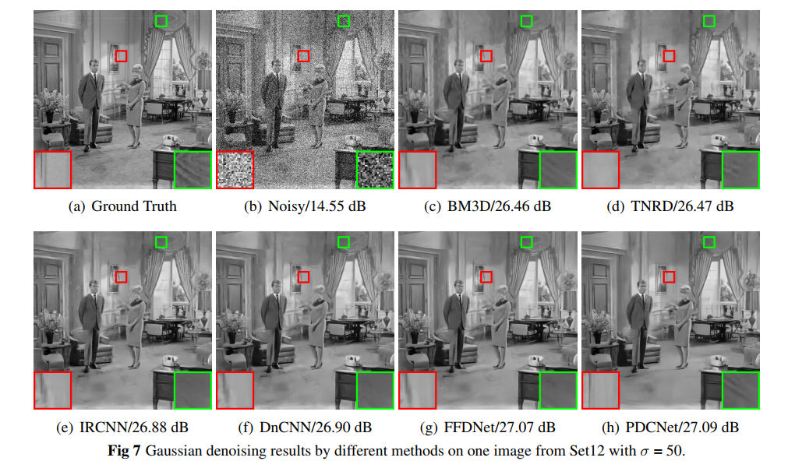
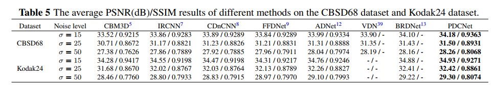
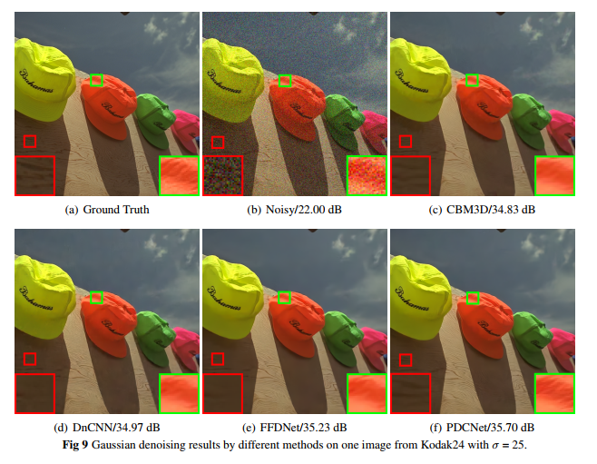
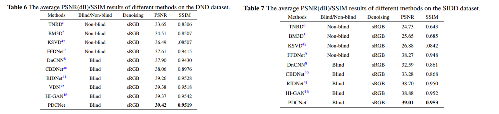
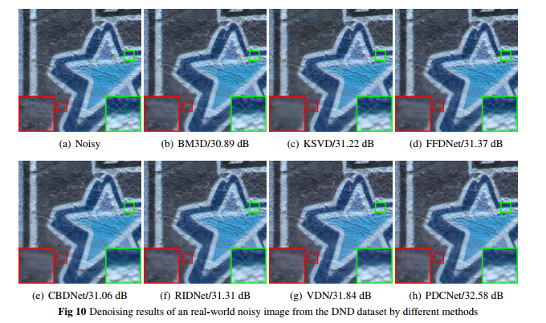

## Pyramid dilated convolutional neural network for image denoising 

## Absract
#### Convolutional neural network (CNN) has been successfully applied to image denoising. In particular, dilated convolution, which expands the network’s receptive field, has been widely used and has achieved good results in image denoising. Losing some image information, a standard network cannot effectively reconstruct tiny image details from noisy images. To solve the problem, we propose a pyramid dilated convolutional neural network (PDCNet) which mainly has three pyramid dilated convolutional blocks (PDCBs) and a gated fusion unit (GFU). PDCB uses dilated convolution to expand the network’s receptive field and the pyramid structure to obtain more image details. GFU fuses and enhances the feature maps from different blocks. Experiments demonstrate that the proposed method outperforms the comparative state-of-the-art denoising methods for gray and color images. In addition, the proposed method can effectively deal with real-world noisy images.

## Keywords   
**Image denoising, Convolutional neural network, Pyramid dilated convolution block, Gate fusion unit, Real-world noisy image.**  

### Network architecture

###  Experimental Results  
#### 1. Gray Image Denoising Results  

#### 2.  Color Image Denoising Results  

#### 3. Denoising Results of Real-world Noisy Photographs  

